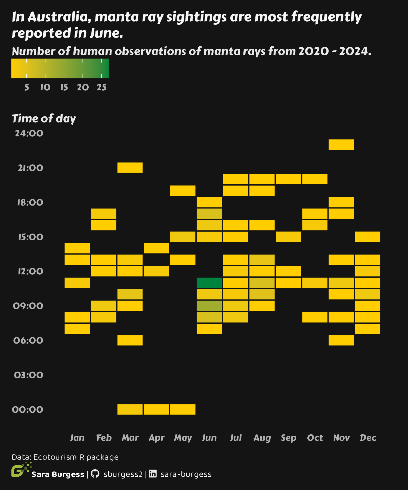

# Ecotourism in Australia

## Description

A heatmap of human observations of manta rays in Australia (2020–2024), from the
Ecotourism R package. Each tile is a month (x-axis) and hour of day (y-axis),
coloured by the number of observations recorded.

